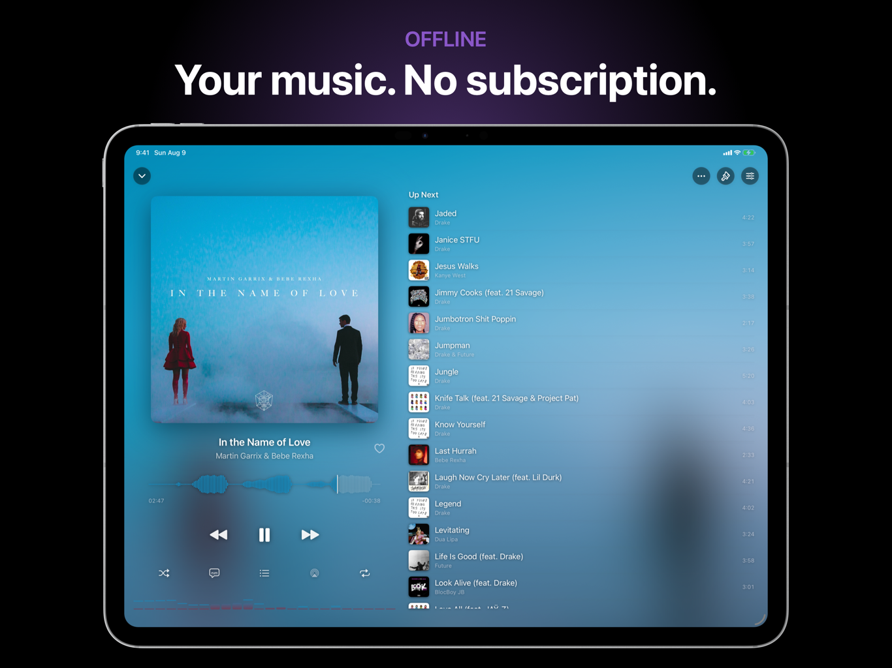

# Corvus Music Player

Your music, offline. Corvus Music Player is a private, full-featured music player for iPhone and iPad, built for the audio files you already own.

[View on the App Store](https://apps.apple.com/app/id6781115973) | [Website](https://corvusdevs.github.io/Corvus-Music-Player/) | [Support](https://corvusdevs.github.io/Corvus-Music-Player/support.html) | [Privacy](https://corvusdevs.github.io/Corvus-Music-Player/privacy.html)

## Highlights

- Offline library with instant search and browsing by song, album, artist, genre, composer, folder, or playlist
- Gapless playback, crossfade, ReplayGain volume leveling, and a fading sleep timer
- Graphic and parametric equalizer with hundreds of measured headphone presets
- Synced lyrics with full-screen presentation and per-song timing adjustment
- Smart playlists, tag editing, duplicate finding, ratings, favorites, history, and bookmarks
- Import through Files, AirDrop, Finder, network servers, or private Wi-Fi Sharing
- CarPlay, AirPlay 2, Lock Screen, Control Center, Dynamic Island, widgets, Siri, and Bluetooth controls
- Purpose-built layouts for iPhone and iPad

## Privacy

No account, analytics, telemetry, advertising, or tracking. Your music library stays on your device.

## Release

Version 1.0 is available on the App Store. It includes the complete offline library, equalizer, lyrics, Wi-Fi Sharing, system playback integrations, and universal iPhone and iPad support.

## Support

For help or bug reports, visit the [support page](https://corvusdevs.github.io/Corvus-Music-Player/support.html) or email [corvusdevs@outlook.com](mailto:corvusdevs@outlook.com).

This public repository contains only the website and public documentation. The application source is private.
