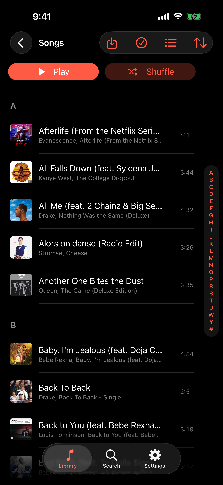

# Corvus Music

Your music. Your terms. Corvus Music is a private, offline music player for the files you already own, with a coral-and-midnight interface designed for iPhone and iPad.

[View on the App Store](https://apps.apple.com/app/id6781115973) | [Visit the website](https://corvusdevs.github.io/Corvus-Music-Player/) | [Support](https://corvusdevs.github.io/Corvus-Music-Player/support.html) | [Privacy](https://corvusdevs.github.io/Corvus-Music-Player/privacy.html)

## What it does

- Plays your MP3, AAC, M4A, ALAC, FLAC, WAV, AIFF, and Opus files without a subscription or account
- Browses by song, album, artist, genre, composer, folder, playlist, and favorites
- Provides gapless playback, crossfade, ReplayGain, a sleep timer, and an editable Up Next queue
- Includes graphic and parametric EQ with measured headphone presets
- Shows synced lyrics with full-screen presentation and per-song timing adjustment
- Imports through Files, AirDrop, Finder, network servers, and private Wi-Fi Sharing
- Supports CarPlay, AirPlay 2, Lock Screen, Control Center, Dynamic Island, widgets, Siri, and Bluetooth controls

## Privacy

No analytics, telemetry, advertising, tracking, or account. Your library and listening history stay on your device.

## Current release

Version 1.0 is available on the App Store. The website previews the coral-and-midnight visual system, consistent library toolbar, faster cold-start loading, and smoother playback transitions coming in the next update.

## Support

For help or bug reports, visit the [support page](https://corvusdevs.github.io/Corvus-Music-Player/support.html) or email [corvusdevs@outlook.com](mailto:corvusdevs@outlook.com).

This public repository contains only the website and public documentation. The application source is private.
